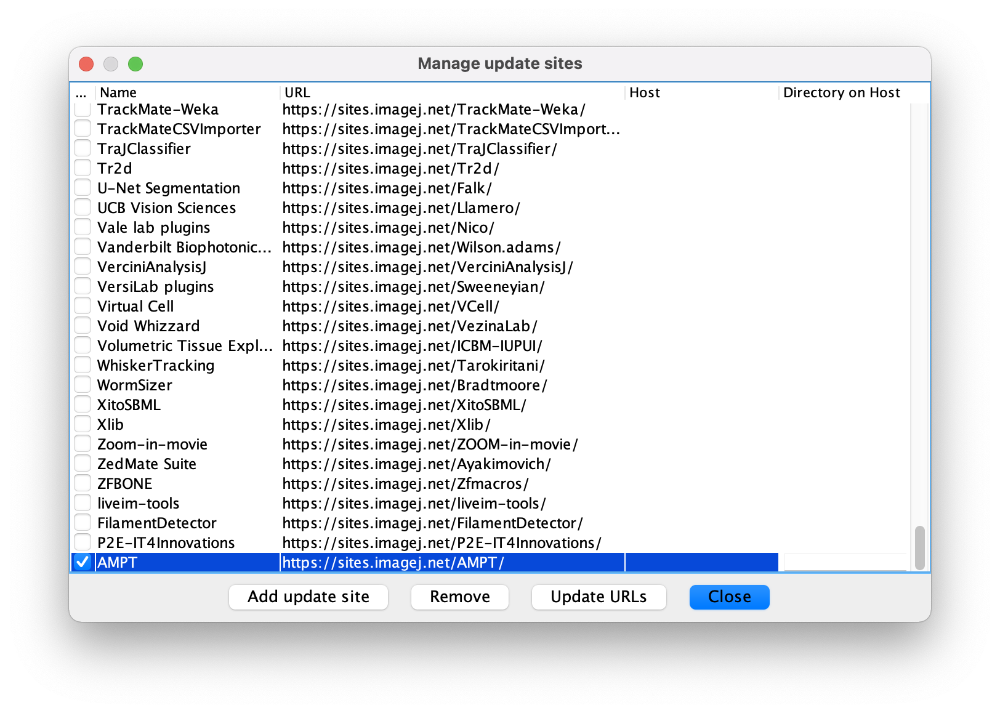
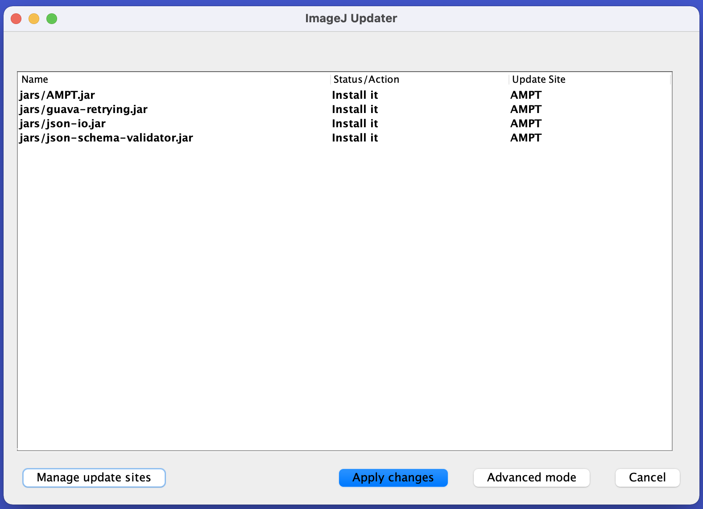

Installation
==========

This tutorial explains how to install ImageJ and the AMPT plugin.

## Download Fiji

Download and unpack Fiji using the distribution appropriate for your platform from the [Fiji
Download](https://imagej.net/software/fiji/downloads) site.

Launch Fiji.

## Install AMPT

Note that these instructions are a specific instance of the more generalized [Following an Update
Site](https://imagej.net/update-sites/following) instructions from ImageJ.

### Start the Updater.

Start the ImageJ Updater (_Help_ > _Update..._)


### Add a new update site

Click on the _Manage update sites_ button to bring up the site management dialoag.

Add AMPT as a new update site.

Name:

```
AMPT
```

URL:

```
https://sites.imagej.net/AMPT/
```

Ensure that the checkbox on the left (in the _Active_ column, though the column header may not be visible) is checked.

Close the dialog.



### Apply changes

At this point, the ImageJ Updater will show an option to install the AMPT plugin and its dependencies. Apply the
changes.



### Restart

Once the plugin has been installed, ImageJ must be restarted. Upon restart, the AMPT plugin will be available from the
_Plugins_ menu.


