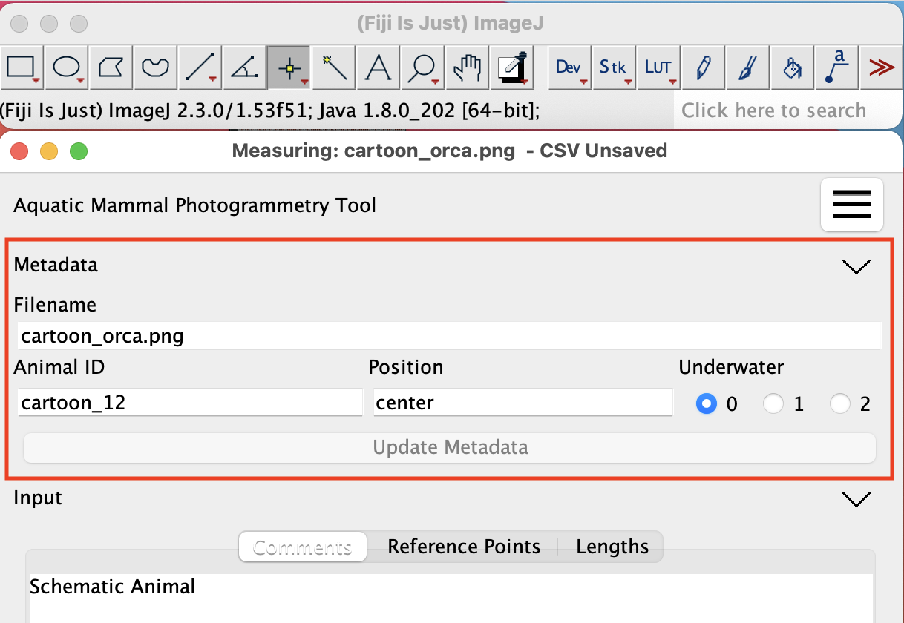

## Metadata

Each image in a CSV file may have a significant amount of associated metadata. AMPT does not support editing most of the metadata at this time. See [CSV Column Configuration](csv_columns_config.md#required-rows) for more details on the supported columns
