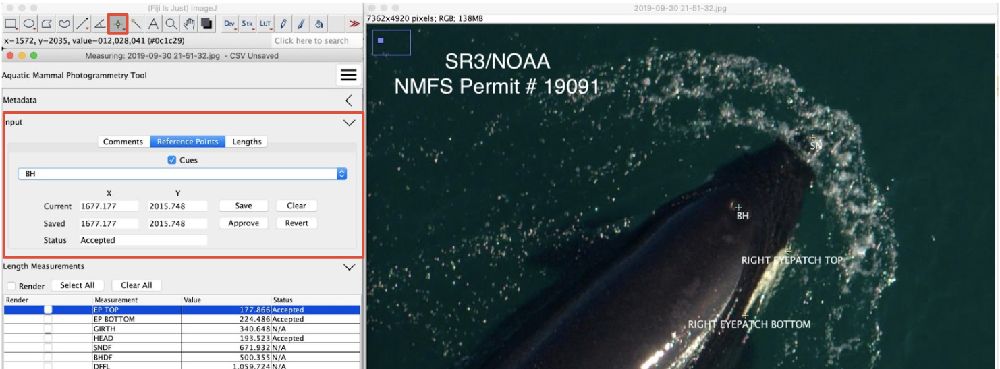
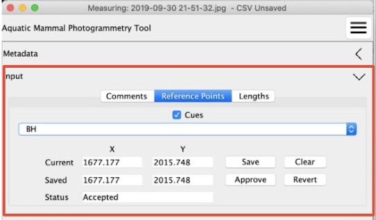
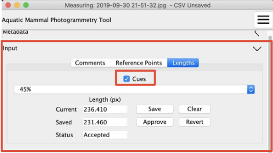

## Input Panel

The input panel is composed of three tabs: *Comments*, *Reference Points*, and *Lengths*. The inputs will automatically load the data the currently active image. Please note that the save button for a measurement or commment must be pressed to actually store the measurement.

## Comments

During measurement the user may enter freeform comments in the *Comments* tab. The *Save Comments* button will be active whenever there are unsaved comments.

## Reference Points

The *Reference Points* tab is used to place measurement landmarks on the image. These landmarks are used to provide cueing for length measurements, and also to automatically perform some measurements of the animal. Please see [Measurement Type](csv_columns_config.md#measurement-type) for information on how to specify an automatically computed length. Rendering the landmarks is controlled by the Cues checkbox. When the Reference Points tab is selected, the ImageJ point selector is automatically activated.

### Reference Points Details

There are a number of controls in the *Reference Points* tab. 

The top control control is the Cues checkbox, which enables the drawing of the defined landmarks in the image. Details on configuring what landmarks are drawn and when they are drawn is described in the section on [Cue and Calculation Configuration](cue_and_calc.md)

The next control is a dropdown list containing the landmarks that the user would like to draw. Selecting from the list will load and draw and existing point for the landmark, and display the currently saved position in the middle two text boxes aligned with the *Saved* label. If a value has been saved it will also be shown in the top two text boxes aligned with the current label.

The buttons control how values are saved and updated as well as the value shown in the *Status* text field. The *Save* button causes the values in the *Current* fields to be written to the CSV data and then loaded into the *Saved* text fields. The status of the landmark will be set to _Unreviewed_ and then shown in the *Status*. The *Clear* button clear the selection in the image and clears the values in *Current*, it does not alter the saved values or the status. The *Revert* button copies the saved value into *Current* and updated the selection in the image, it does not alter the status. The *Approve* button updates the status for the landmark to _Accepted_ and then causes that to be loaded into the *Status* field.

### Defining landmarks
In order for a landmark to appear in this list the landmark be defined as two entries of the form "_landmark\_name_\_x" and "_landmark\_name_\_y" both with type `point` in the [CSV-Columns.csv](csv_columns_config.md#default-csv-columnscsv) file. An additional entry of the form "_landmark\_name_\_reviewed" with type `boolean` is also required.

## Lengths

The *Lengths* tab is similiar to the *Reference Points*, but is used for taking manual length measurements. Rendering the length guidelines is controlled by the Cues checkbox. When the *Lengths* tab is selected, the ImageJ line selector is automatically activated.

### Length Details

The controls and cues in the *Lengths* tab behave like the controls in the [*Reference Points*](#reference-points-details) tab.

### Defining lengths
In order for a length to appear in this list the length be defined as four entries of the form "_landmark\_name_\_x\_start",  "_landmark\_name_\_y\_start", "_landmark\_name_\_x\_end", and "_landmark\_name_\_y\_end" all with type `auto point` in the [CSV-Columns.csv](csv_columns_config.md#default-csv-columnscsv) file. An additional entry of the form "_landmark\_name_\_reviewed" with type `boolean` is also required.

