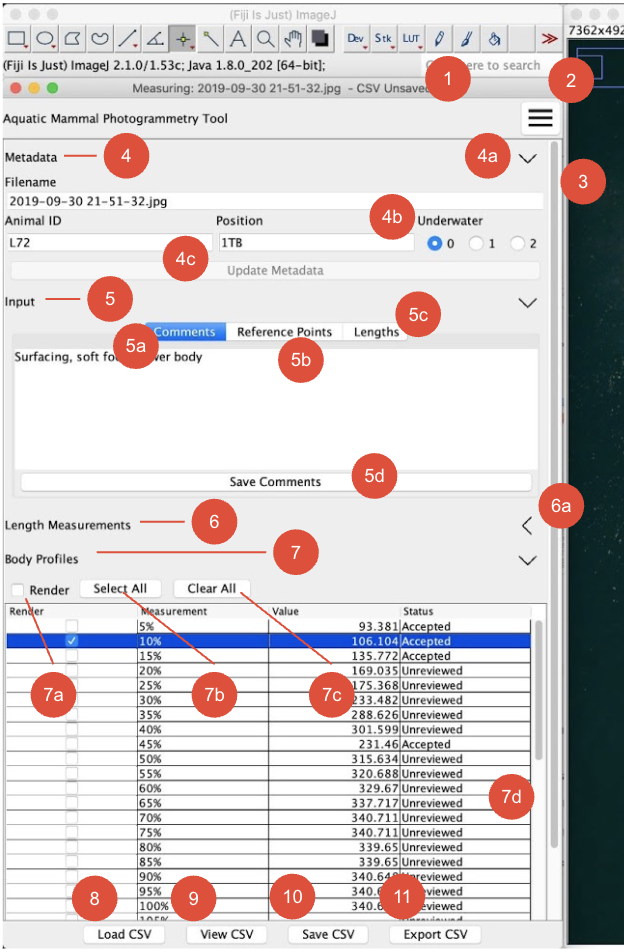

Quick Tour
==========
## AMPT Interface
{: usemap="#legend" :}
<map name="legend">
      <area target="_blank" alt="google" title="google" href="http://Google.com" coords="450,79,79" shape="circle">
</map>

## Components

1. Image filename and CSV saved/unsaved indicator
1. Hamburger menu where “About Tool” and “User Guide” are stored
1. Scroll Bar
1. Medata section of AMPT panel

    1. Accordion (expanded state)
    1. Underwater selection
    1. Update Metadata button (inactive state)

1. Input section of AMPT panel

    1. Comments tab (active when blue)
    1. Reference points tab
    1. Lengths measurements tab
    1. Save comment button (active state)

1. Length Measurements section of AMPT panel displays lengths data
    
    1. Accordion (collapsed state)
    
1. Body Profiles section of AMPT panel display
   
    1. Render checkbox
    1. Select All butto
    1. Clear All button
    1. Body Profile selection scrollbar

1. Load CSV
1. View CSV
1. Save CSV
1. Export CSV
